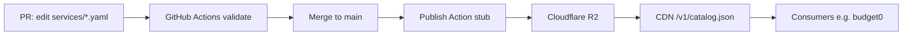

# Subdrop — Product Requirements Document

**Version:** 1.0 (seed)  
**Status:** Draft — git-native catalog, R2 publish stub  
**Last updated:** 2026-08-21

---

## Problem

We need a **stable, public catalog** of popular US consumer subscription services with typical advertised prices. The first prototype bound `logoUrl` to a Vercel preview host behind SSO, which made logos and JSON unsuitable as a long-lived public API. Preview URLs rot, access is gated, and consumers cannot rely on the bundle.

Subdrop separates **durable source data in git** from **published static assets on a CDN** (Cloudflare R2, wired later).

---

## Goals

1. **Git as CMS** — one YAML file per service; changes land via reviewed PRs.
2. **Agent-friendly** — clear schema, validation scripts, and `AGENTS.md` so coding agents can open PRs safely.
3. **Static public API** — `/v1/catalog.json` served from object storage, no database on read path.
4. **Relative logos in source** — `logos/netflix.svg` in YAML; absolute `logoUrl` only at publish time when `--host` is set.
5. **Provenance fields** — `sourceUrl` and `priceCheckedAt` on every service row.
6. **CC0 catalog data** — prices and metadata are public domain; trademarks stay with owners.

---

## Non-goals (v1)

| Non-goal | Rationale |
|----------|-----------|
| User submissions | Curated PRs only; no public “add my SaaS” form |
| Scrape-to-prod | No bot commits directly to `main`; humans/agents verify prices |
| D1 / DB on reads | Catalog is rebuilt JSON; reads are CDN cache hits |
| Real-time pricing | Snapshot catalog; refresh via PRs |
| Global regions | v1 is **US** / **USD** only (`catalog.yaml`) |
| Logo licensing automation | Marks added manually under `logos/`; hashed/aliased logos later |

---

## System flow



1. Contributor or agent edits `services/<id>.yaml` (and optionally `logos/`).
2. PR runs `scripts/validate.py` and `scripts/build-catalog.py`.
3. Merge to `main` triggers publish (currently **`if: false` stub**).
4. Future publish uploads `dist/catalog.json` and `logos/` to R2 with a stable public host.
5. Consumers fetch JSON + logos from the CDN, not from git or Vercel previews.

---

## Repository layout

| Path | Purpose |
|------|---------|
| `catalog.yaml` | Name, description, schemaVersion, region, currency, license |
| `categories.yaml` | List of `{ id, label }` (14 categories) |
| `services/<id>.yaml` | One flat document per service |
| `schema/service.schema.json` | Machine-readable contract |
| `schema/service.example.yaml` | Netflix reference row |
| `scripts/validate.py` | CI gate: ids, math, dates, forbidden keys |
| `scripts/build-catalog.py` | Glue YAML → `catalog.json` |
| `scripts/yaml_lite.py` | Dependency-free YAML subset |
| `logos/` | Brand marks; relative paths in source |
| `.github/workflows/validate.yml` | PR + push validation |
| `.github/workflows/publish.yml` | R2 stub (disabled) |

---

## Service field reference

All service files are **flat YAML** (no nesting). `additionalProperties: false` in schema.

| Field | Required | Type | Notes |
|-------|----------|------|-------|
| `id` | yes | string | Slug; must match filename |
| `name` | yes | string | Display name |
| `category` | yes | string | Must exist in `categories.yaml` |
| `plan` | yes | string | Plan tier label (e.g. Standard, Plus) |
| `priceUsd` | yes | number | Advertised price in USD for the billing period |
| `billing` | yes | enum | `month`, `year`, or `week` |
| `monthlyUsd` | yes | number | Normalized monthly equivalent |
| `url` | yes | string | Official service URL |
| `sourceUrl` | yes | string | Page used to verify price (often same as `url` in seed) |
| `priceCheckedAt` | yes | string | `YYYY-MM-DD` verification date |
| `domain` | yes | string | Primary domain |
| `logo` | yes | string | Relative path: `logos/<file>.(svg\|png\|webp)` |
| `blurb` | no | string | Short description |
| `rank` | no | integer | Sort weight (higher = more prominent) |
| `color` | no | string | Brand hex |
| `simpleIconsSlug` | no | string | Fallback icon slug |
| `billingMonth` | no | integer 1–12 | **Yearly only.** Typical calendar month charged; omit if anniversary-billed or unknown |

### Forbidden in source YAML

- `logoUrl` — added only in published JSON when built with `--host`
- `homepage` — use `url`
- Any absolute preview URL (Vercel, etc.)

### monthlyUsd rules

| billing | Expected monthlyUsd |
|---------|---------------------|
| `month` | `priceUsd` |
| `year` | `priceUsd / 12` |
| `week` | `priceUsd * 52 / 12` |

Validator allows ±0.02 rounding tolerance.

### billingMonth guidance

Only set when a **yearly** plan has a well-known **calendar** renewal (e.g. “renews every January”). Do **not** guess. Anniversary-billed annual plans omit the field.

---

## Public API

**Endpoint (future):** `GET /v1/catalog.json`

**Build output shape** (from `scripts/build-catalog.py`):

```json
{
  "schemaVersion": 1,
  "name": "Subdrop",
  "description": "...",
  "region": "US",
  "currency": "USD",
  "license": "CC0-1.0",
  "licenseNote": "...",
  "generatedAt": "2026-08-21T16:00:00Z",
  "count": 91,
  "categories": [{ "id": "streaming", "label": "Streaming" }],
  "services": [ /* flat service objects */ ]
}
```

When published with `--host https://cdn.example.com`, each service may include:

```json
"logoUrl": "https://cdn.example.com/logos/netflix.svg"
```

Source repos never store that URL.

---

## Agent workflow

1. Read `AGENTS.md` and `schema/service.example.yaml`.
2. Edit or add `services/<id>.yaml`.
3. Set `sourceUrl` + `priceCheckedAt` for any price change.
4. Run `python3 scripts/validate.py` and `python3 scripts/build-catalog.py`.
5. Open PR; wait for green CI.
6. Do not add `logoUrl`, scrape-to-prod, or user-submission endpoints.

---

## Publish workflow (stub)

`.github/workflows/publish.yml` is intentionally disabled (`if: false`). When enabling:

- Secrets: `R2_ACCOUNT_ID`, `R2_ACCESS_KEY_ID`, `R2_SECRET_ACCESS_KEY`, `R2_BUCKET_NAME`, `R2_PUBLIC_HOST`
- Steps: validate → build with `--host` → upload `catalog.json` + sync `logos/`
- Cache headers: long TTL on JSON and logos; invalidate on deploy only

---

## First consumer: budget0

[budget0](https://github.com/JSzesze/budget0) (planned) is a personal subscription budget app. Integration rules:

- Fetch `/v1/catalog.json` from the Subdrop CDN (not git raw, not preview hosts).
- Use `monthlyUsd` for **display normalization** only (compare plans across billing periods).
- **Do not** bind a user’s actual charge amount or renewal date to `monthlyUsd` alone — use user-entered amounts and dates; optional hints from `billingMonth` when present for yearly rows.
- Prefer `simpleIconsSlug` or bundled placeholders when `logoUrl` is missing in dev.

---

## v1 ship bar

- [x] 91 seeded services from curated catalog
- [x] `validate.py` exits 0 on CI
- [x] `build-catalog.py` produces `count: 91`, `region: US`, `currency: USD`
- [x] JSON Schema + example + agent docs
- [x] Validate workflow on PR/push
- [ ] Publish workflow enabled with R2
- [ ] Stable CDN URL documented
- [ ] Logo binaries populated where permitted

---

## Later

| Item | Notes |
|------|-------|
| **Aliases** | `disney-plus` ↔ `disney+` search keys without duplicating rows |
| **Hashed logos** | Content-addressed filenames for cache busting |
| **Bundles** | “Disney bundle” pseudo-rows linking member services |
| **Multi-region** | EU/G UK currency rows with separate region field |
| **Price history** | Optional git log or sidecar `history/` — not v1 |
| **Webhook on merge** | Notify consumers to refresh catalog cache |

---

## License

Catalog **data** is [CC0 1.0](../LICENSE). **Trademarks** and logos remain with their owners.
